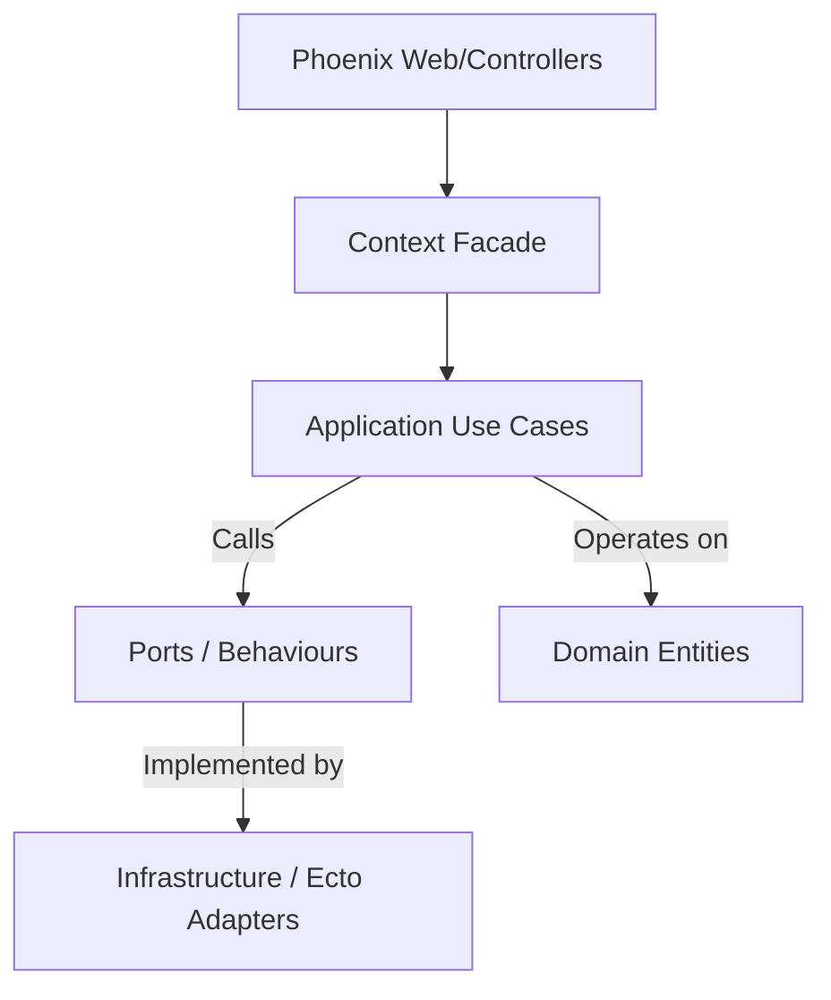

# HexaGen

Standardized Hexagonal Architecture Scaffolding for Phoenix Applications. The Architecture Guardian for Phoenix, build clean ecosystems, not spaghetti code.

HexaGen extends the default Phoenix generators to enforce a clean separation of concerns using the Ports and Adapters pattern. It helps keep business logic pure and decoupled from technical details like databases or external APIs.

## Why HexaGen?

Standard Phoenix contexts often become large and mix Ecto logic with business rules. HexaGen solves this by enforcing a directory structure that follows SOLID principles out of the box.

HexaGen is not just a generator; it's a strict architectural guardian. It extends Phoenix to enforce a pure Ports and Adapters (Hexagonal) pattern, automating infrastructure, tests, and monitoring. By strictly decoupling business logic from the web layer, HexaGen allows development teams to save up to 40% of setup time, letting developers focus entirely on what matters: the core business rules.

### The Architecture



## Features

- Domain Layer: Pure Elixir structs representing business entities.
- Application Layer: Isolated Use Cases (one module per action) and Ports (contracts).
- Infrastructure Layer: Technical implementations (Ecto adapters) that can be easily swapped.
- Dependency Injection: Dynamic adapter injection using Elixir configuration.
- Built-in Mocking: Pre-configured setup for Mox for fast unit tests.
- High Code Coverage: Extensively tested for reliability.

## Getting Started

### 1. Installation

Add hexagen to your mix.exs:

```elixir
def deps do
  [
    {:hexagen, "~> 0.1.0", only: :dev}
  ]
end
```

### 2. Setup

Run the setup task to prepare the project folders:

```bash
mix hexagen.setup
```

### 3. Generate a Hexagonal Context

```bash
mix hexagen.gen.context Accounts User users name:string age:integer
```

### 4. Generate Web Layers

```bash
mix hexagen.gen.html Accounts User users name:string
mix hexagen.gen.json Accounts User users name:string
mix hexagen.gen.live Accounts User users name:string
```

## SOLID Compliance

- S: Single Responsibility - One module per Use Case.
- O: Open/Closed - Add new adapters without touching business logic.
- L: Liskov Substitution - Swap implementations via Behaviours.
- I: Interface Segregation - Clean Ports define exact requirements.
- D: Dependency Inversion - High-level logic depends on abstract Ports.

## Contributing

Contributions are welcome. If you have suggestions for improving the scaffolding or adding new adapters, please open an issue or pull request.
